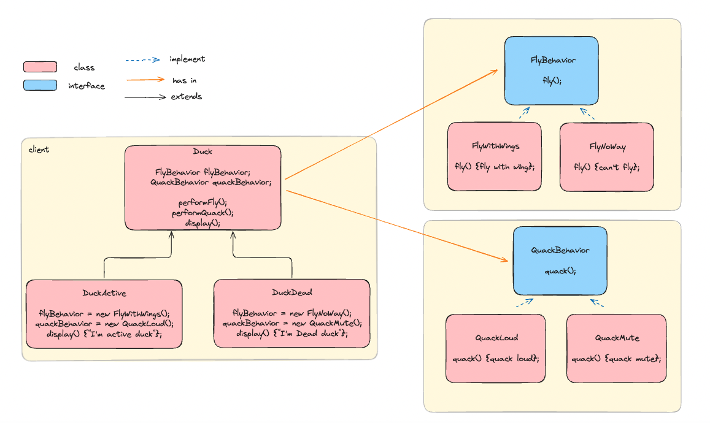
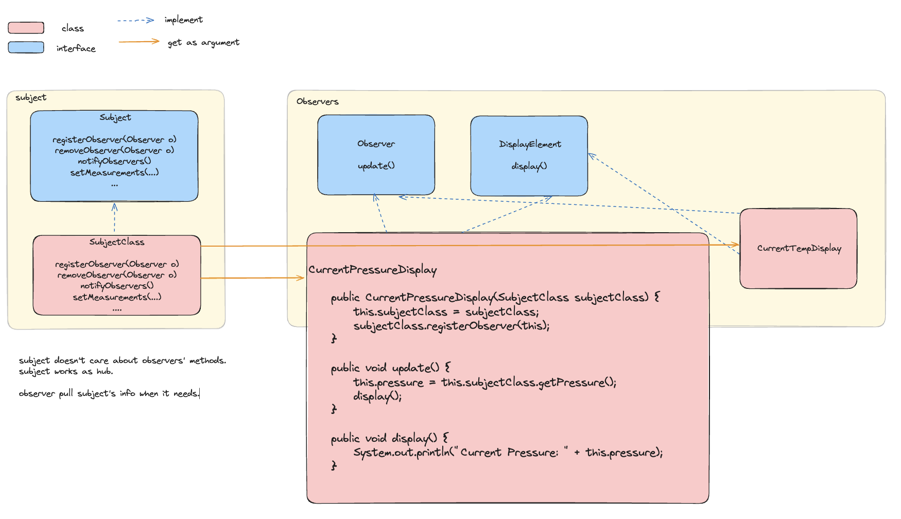
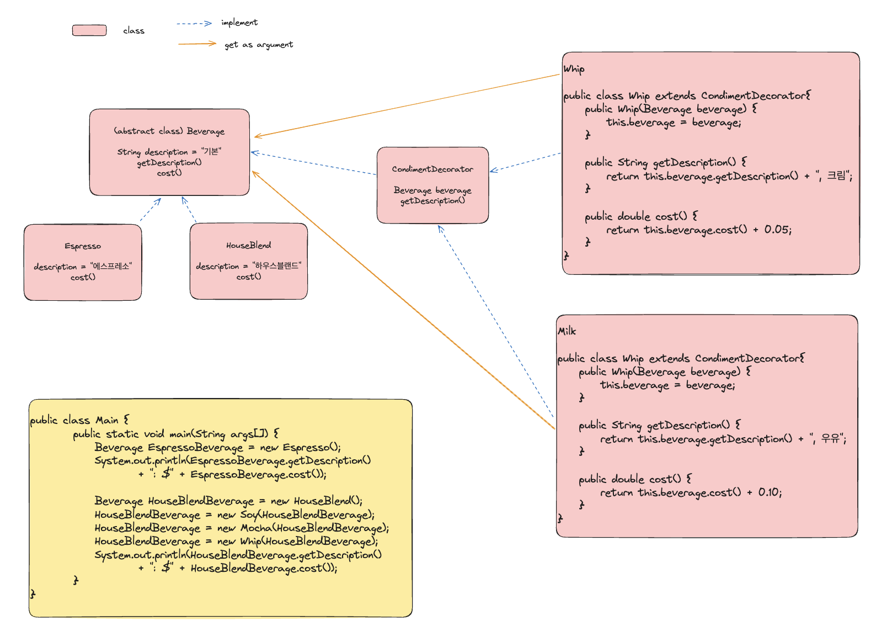
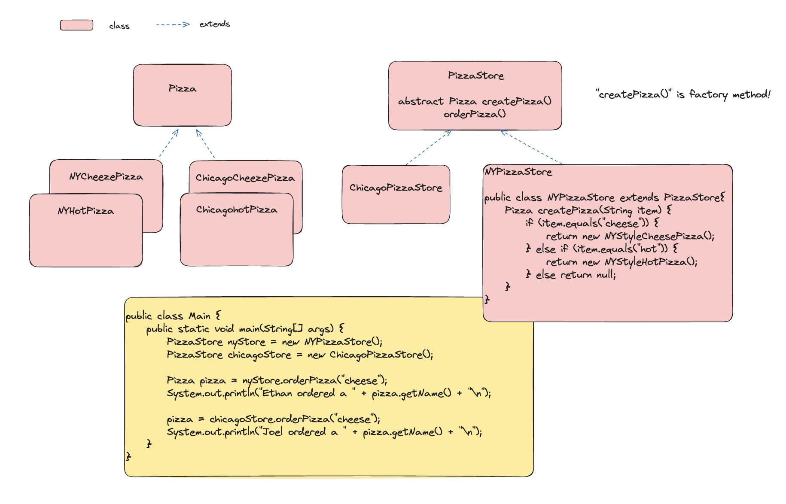

# design-pattern-study
디자인패턴을 공부하며 구현한 코드를 정리하는 레포 (Java, Python)

## strategy pattern (전략패턴)
- 알고리즘군을 정의하고 캡슐화해서 독립적으로 알고리즘군을 수정가능케 함

## observer pattern (옵저버 패턴)
- 한 객체의 상태가 바뀌면 그 객체에 의존하는 다른 객체에게 연락이 가고 자동으로 내용이 갱신되는 방식으로 일대다 의존성을 정의한다.
  - subject 는 observer 가 observer interface 를 구현한다는 사실만 알고 그 외에는 모름
  - observer 는 언제든지 추가, 삭제 가능
  - 새로운 형태의 observer 가 추가되어도 subject 를 변경할 필요가 없음
  - 즉, subject 와 observer 는 느슨한 결합 (loosely coupled) 상태

## decorator pattern (데코레이터 패턴)
- 객체에 추가 요소를 동적으로 더할 수 있다.
- 한 객체를 여러 개의 데코레이터로 감쌀 수 있다.

## factory pattern (팩토리 패턴)
### factory method pattern (팩토리 메소드 패턴)
- 클래스 인스턴스 만드는 일을 서브클래스에게 맡긴다. 사용하는 서브클래스에 따라 생산되는 객체 인스턴스가 결정된다.
- 팩토리 메소드는 추상 메소드로 구현되어 있고 서브클래스에서 이를 구현한다.

### abstract factory pattern (추상 팩토리 패턴)
- 구상 클래스에 의존하지 않고 서로 연관되거나 의존적인 객체로 이루어진 제품군을 생성하는 인터페이스를 제공한다.
- 구상 클래스는 서브클래스에서 만든다.
- 팩토리 매소드와 거의 유사하나 `NYPizzaStore` 에서 바로 각 피자 객체를 만드는 것이 아니라 `IngrediendFatory` 를 이용한다.